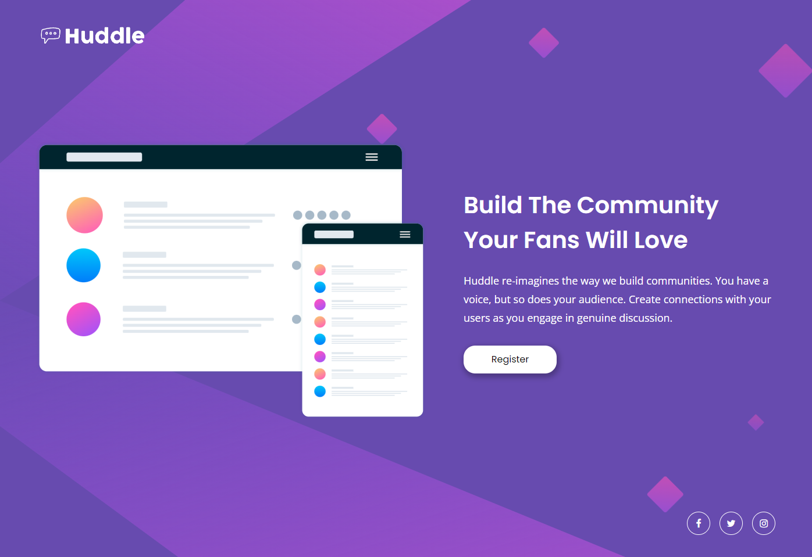

<h1 align="center">Huddle landing page with a single introductory section</h1>

  <h3>
    <a href="#">
      Live
    </a>
    | 
    <a href="#">
      Solution
    </a>
    | 
    <a href="https://www.frontendmentor.io/challenges/huddle-landing-page-with-a-single-introductory-section-B_2Wvxgi0">
      Challenge
    </a>
  </h3>

## 📝 About the Project

The goal of this project is to recreate a design provided by frontendmentor.io using fundamental frontend technologies. The application has been designed to support responsive web design (RWD), ensuring an optimal layout on mobile devices, tablets, and desktops, facilitated through the designation of three breakpoints at 576px, 960px, and 1240px.
Given the project's small scope, it has been coded in a single file for convenience. It should be noted that for production use, it is recommended to transition from CDN to a more robust solution such as PostCSS or utilizing a CLI to enhance maintainability and performance.

## 🪚 Built with

- Semantic HTML5 markup
- Tailwind CSS
- Mobile-first workflow

## 👨‍💻 Author

**Maciej Narejko**

- Frontend Mentor - [@MaciejNarejko](https://www.frontendmentor.io/profile/MaciejNarejko)
- GitHub - [@MaciejNarejko](https://github.com/maciejnarejko)
- LinkedIn - [@Maciej-Narejko](https://www.linkedin.com/in/maciej-narejko)

## 💖 Acknowledgments

Thanks to the FrontendMentor.io community for a code review.
Together we create better code.
